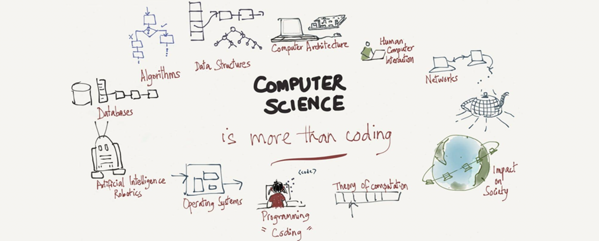

WELCOME TO THE BRANDEIS INTERNSHIP LIST 

 GET IN TOUCH WITH BRANDEIS STUDENTS WITH INTERNSHIP EXPERIENCE TO LAND ONE YOURSELF 

 
 CURRENT UDRS 
 - Yalda Mauj
- Jimkelly Percine
- Gabrielle Pile
- Gianna Everette
- Sydney Cohen
 
 BRANDEIS COSCI HANDBOOK: https://docs.google.com/document/d/1skDckhZJi6OQxjraKNVEZfxflTE4Jy8kxCJtpNu3O1Y/edit?usp=gmail 

 
 Connect with Contributors
 https://docs.google.com/document/d/1XWu8NFlqvPPQSOIbt93K7tdSejl2mA1KmV7HSjAZLMs/edit?usp=sharing
 
 List of internships within the COSI Department 
|    | COMPANY            |   RANK 1-5 | NOTES                                                                                                                                                                                                                                                                                                                                                                                                                                                                                                                                                                        | Application List                                                                                                                                                                              |
|---:|:-------------------|-----------:|:-----------------------------------------------------------------------------------------------------------------------------------------------------------------------------------------------------------------------------------------------------------------------------------------------------------------------------------------------------------------------------------------------------------------------------------------------------------------------------------------------------------------------------------------------------------------------------|:----------------------------------------------------------------------------------------------------------------------------------------------------------------------------------------------|
|  1 | Google             |          5 | Make sure you show strength in good technical communication during the interviews; Also apply early                                                                                                                                                                                                                                                                                                                                                                                                                                                                          | https://careers.google.com/jobs/results/?employment_type=INTERN&jlo=en_US&q=STEP                                                                                                              |
|  2 | Publicis Sapient   |          5 | Start practicing behavioral/basic interview questions (questions about what you would do in certain situations in the workspace) and have in your mind certain experiences from your life that you can draw from to answer them.                                                                                                                                                                                                                                                                                                                                             | https://www.publicissapient.com/                                                                                                                                                              |
|  3 | PayPal             |          5 | Prepare early, apply early, don’t be discouraged                                                                                                                                                                                                                                                                                                                                                                                                                                                                                                                             | http://paypal.com/                                                                                                                                                                            |
|  4 | Microsoft          |          5 | Prepare early, apply early, don’t be discouraged                                                                                                                                                                                                                                                                                                                                                                                                                                                                                                                             | http://microsoft.com/                                                                                                                                                                         |
|  5 | Amazon             |          5 | When you take the time outside the classroom to develop your skills in practical area in which you enjoy your employer will take notice and it will benefit you in the long run in comparison to those who don't take the initiative to hold themselves accountable while they pursue things in which they are most passionate.                                                                                                                                                                                                                                              | https://www.amazon.jobs/en/teams/internships-for-students                                                                                                                                     |
|  6 | CommScope          |          5 | 1. start apply early (I started applying around June and got the first offer late August for next year internship) 2. build a great resume (ask your friends, people in the industry to read your resume, the more the better), do side projects, hackathons, etc... things that showcase the skills that companies are looking for                                                                                                                                                                                                                                          | https://jobs.commscope.com/search/?createNewAlert=false&q=&locationsearch=&optionsFacetsDD_title=&optionsFacetsDD_department=Early+Careers&optionsFacetsDD_location=&optionsFacetsDD_country= |
|  7 | IMC Trading        |          5 | 1. try to get a referral: get someone on LinkedIn maybe from Brandeis, or whoever has something similar to you. 2. apply to non-target companies first to gain experience and confidence. Practice whenever you can, don't wait til last minute                                                                                                                                                                                                                                                                                                                              | https://careers.imc.com/ap/en/c/internships-jobs                                                                                                                                              |
|  8 | Adobe              |          5 | Get started early.                                                                                                                                                                                                                                                                                                                                                                                                                                                                                                                                                           | /                                                                                                                                                                                             |
|  9 | Sonos              |          5 | /                                                                                                                                                                                                                                                                                                                                                                                                                                                                                                                                                                            | /                                                                                                                                                                                             |
| 10 | Gnar company       |          5 | LEARN Academy is trying to promote internships in the Ruby/Rails community.                                                                                                                                                                                                                                                                                                                                                                                                                                                                                                  | /                                                                                                                                                                                             |
| 11 | iRobot             |          5 | Talk about yourself. projects, things you did to apply that knowledge you have from school                                                                                                                                                                                                                                                                                                                                                                                                                                                                                   | https://irobot.wd5.myworkdayjobs.com/iRobot?_ga=2.144828087.2021781397.1627654807-1547478520.1627654805                                                                                       |
| 12 | Bob Stachel        |          5 | I'm retired so I don't have direct contacts. But looking outside the computer industry in technology driven areas like health care might be promising. Biotech, in Massachusetts. Emphasize data science skills.                                                                                                                                                                                                                                                                                                                                                             | /                                                                                                                                                                                             |
| 13 | Zebra Technologies |          5 | apply to a BUNCH, no such thing as too many as you can apply to 100 and still not get an interview, don't lose hope, also make sure to get your leetcode practice in                                                                                                                                                                                                                                                                                                                                                                                                         | https://www.zebra.com/us/en/about-zebra/careers.html                                                                                                                                          |
| 14 | Shopify            |          5 | find a connection, be it someone you actually know (or can be introduced to) or generate ("hey we have X in common and I'm looking at your company", for example "we both went to Brandeis")                                                                                                                                                                                                                                                                                                                                                                                 | https://www.shopify.com/careers/dev-degree-2023-remote-americas_8f2a8000-42e4-49a9-b0ec-d84bc367bb0f                                                                                          |
| 15 | Red Hat            |          5 | Have past experience or an interest in open source software                                                                                                                                                                                                                                                                                                                                                                                                                                                                                                                  | https://careers-redhat.icims.com/jobs/search?ss=1&searchKeyword=internship                                                                                                                    |
| 16 | Squarespace        |          5 | On a tactical note, I do think Squarespace hires for summer interns during the prior fall semester (so extended offers for summer 2023 interns in fall 2022), but there are definitely some companies who hire all throughout the spring to find summer interns. As a junior at Brandeis, I didn't receive an internship offer until April (this was in 2014). Hiatt used to have some partnerhips/listings for local companies who wanted to hire software development interns, and I believe that's how I was connected with Milcord which is a small R&D firm in Waltham. | https://www.squarespace.com/careers/early-career                                                                                                                                              |